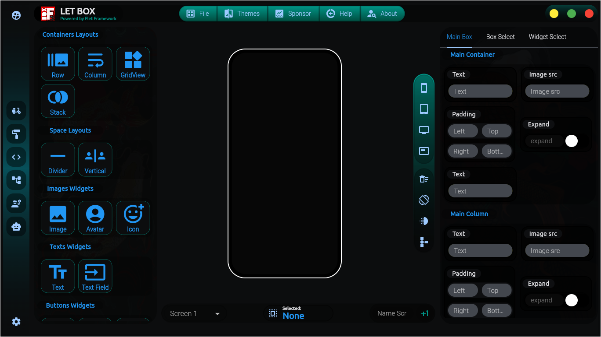
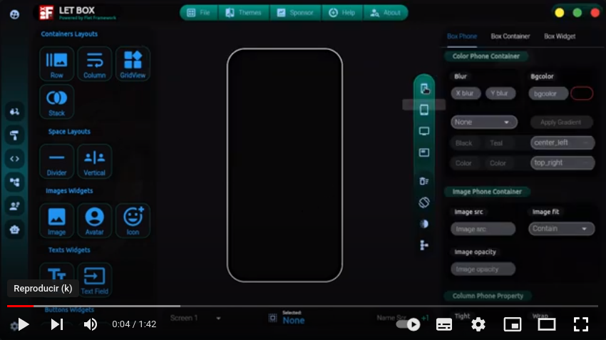
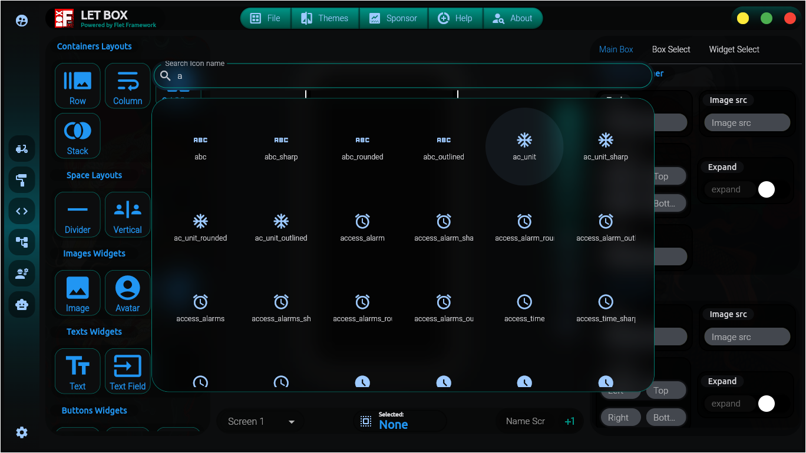
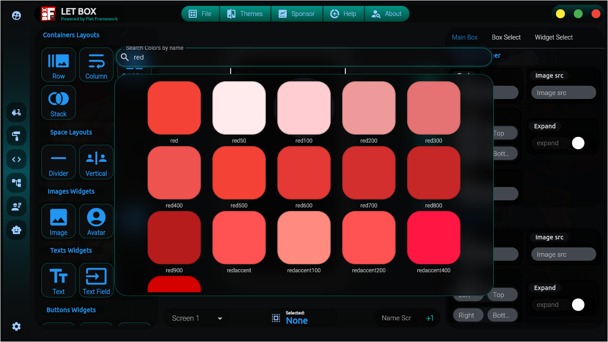
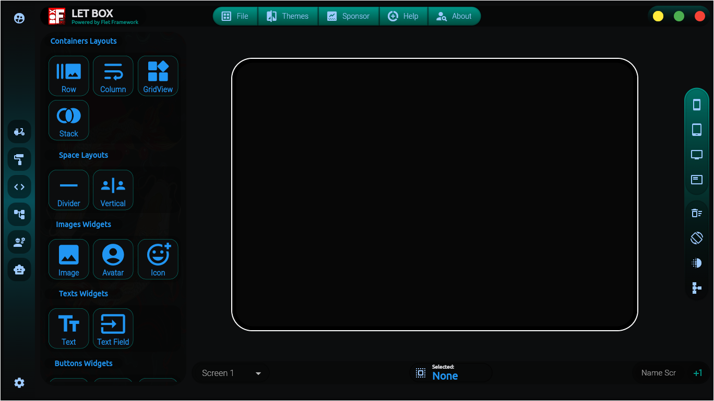
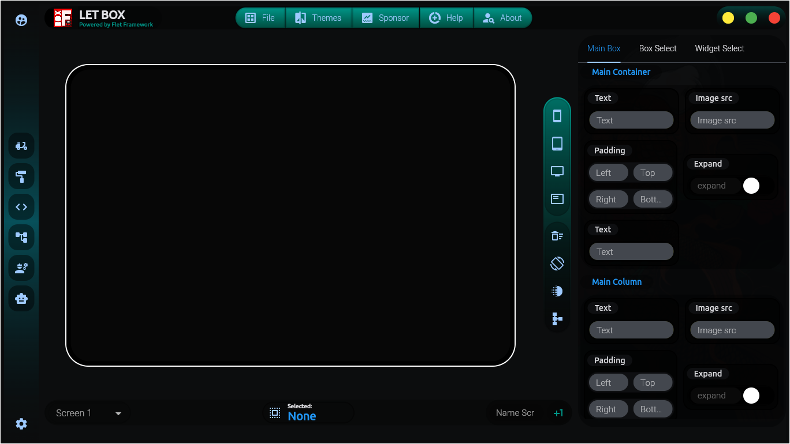

<!--  -->
<!-- markdownserver http://localhost:8009/README.md -->
<!-- http://localhost:8080/Desktop/git_hub/flet_box/docs/Roadmap#flet-box-framework-roadmap -->


## Flet-Box:
### It's a Python GUI Framework for Multi-Platform Apps

[](https://www.youtube.com/watch?v=15DDAACb0Hw)

<details>
    <summary>Gallery Preview FLET-BOX</summary>
    
    
    
    
    
</details>


[More info documentation](https://github.com/xavier53348/Flet-Box/blob/main/docs/WIDGET.md)

[Our goals and Roadmap](https://github.com/xavier53348/Flet-Box/blob/main/docs/Roadmap.md)

**Certainly!** Let's create a documentation for **Flet-Box**, a GUI framework that simplifies building multi-platform apps using drag-and-drop widgets in the Python language.

## Instalation Flet-Box
```bash

>>> mkdir My_app
>>> cd My_app

```
## Run one time
```bash

>>> python3 -m venv .venv

```
## Activate virtual env
```bash

>>> source .venv/bin/activate
>>> pip install flet
>>> pip install -r requirements.txt

```
## Install manually

```
>>> git clone https://github.com/xavier53348/Flet-Box.git

```
## By pypi repo

```
>>> pip install flet-box-gui

```
## Easy run Flet-Box
```bash

>>> flet flet_box/flet_box.py

```
## Easy way run a save APP

```
>>> flet test/proyect_name/proyect_name/main.py

```
### Introduction
**Flet-Box** is a powerful framework that enables developers to create interactive multi-user web, desktop, and mobile applications. Whether you're a seasoned developer or just starting out, **Flet-Box** makes frontend development accessible without prior experience. Here are the key features:

1. **Cross-Platform**: Build apps that run seamlessly on web browsers, desktop environments (like macOS and Windows), and mobile devices.

2. **Drag-and-Drop Widgets**: Easily design your app's user interface by dragging and dropping widgets.

3. **Based on Flutter**: **Flet-Box** is a fork of **Flet Framework** leverages the power of Flutter by Google, but it doesn't stop there. It adds its own opinion by combining smaller widgets, implementing UI best practices, and applying reasonable defaults to ensure your apps look professional without extra effort.

### Getting Started with Flet-Box in Python
To get started, you don't need to be a front-end guru, but basic knowledge of Python and object-oriented programming is recommended. Let's dive into the basics:

### Learn More
Ready to build real-world apps? Check out the [official Flet documentation](https://flet.dev/docs/) and explore tutorials for your preferred language, including Python3. Happy coding! 🚀

### Widgets aviables with Flet-Box Now on building

Certainly! In **Flet-Box**, you can create drag-and-drop interactions using the **LongPressDraggable** widget. Let's break down how to achieve this:

1. **LongPressDraggable**: This widget recognizes when a user performs a long press (sometimes called touch & hold) on a widget. It then displays a new widget near the user's finger. As the user drags, the widget follows their finger. You have full control over the widget that the user drags.

- Wrap your UI element (widget) with a **LongPressDraggable**. For example, if you have a list of menu items, each displayed using a custom **MenuListItem** widget, you can wrap it like this:

## Widgets will be Updating ...
#### You mey use now the currents widgets that are marked

| **SPACE LAYOUTS**        |   | **IMAGE WIDGET**         |   | **ALERTS STATUS**        |   |
|--------------------------|---|--------------------------|---|--------------------------|---|
| ft.divider               | ✔ | ft.image                 | ✔ | ft.snackbar              | ✘ |
| ft.verticaldivider       | + | ft.circleavatar          | + | ft.tooltip               | ✔ |
|                          |   | ft.icon                  | ✔ | ft.cupertinoalertdialog  | ✘ |
|                          |   |                          |   | ft.cupertinodialogaction | ✘ |
|                          |   |                          |   |                          |   |
| **CONTAINERS LAYOUTS**   |   | **CHARTS LAYOUTS**       |   | **TEXT WIDGET**          |   |
| ft.stack                 | ✔ | ft.barchart              | ✘ | ft.text                  | ✔ |
| ft.row                   | ✔ | ft.charts                | ✘ | ft.textfield             | ✔ |
| ft.gridview              | ✔ | ft.linechart             | ✘ | ft.listview              | ✘ |
| ft.column                | ✔ | ft.matplotlibchart       | ✘ | ft.datatable             | ✘ |
| ft.container             | ✔ | ft.piechart              | ✘ |                          |   |
| ft.card                  | ✘ | ft.plotlychart           | ✘ |                          |   |
| ft.responsiverow         | ✘ |                          |   |                          |   |
| ft.transparentpointer    | ✘ |                          |   |                          |   |
|                          |   |                          |   |                          |   |
| **BUTTONS WIDGET**       |   | **SELECTIONS WIDGET**    |   | **ESPECIAL WIDGET**      |   |
| ft.textbutton            | ✔ | ft.switch                | ✘ | ft.tabs                  | ✘ |
| ft.filledbutton          | ✔ | ft.checkbox              | ✔ | ft.navigationbar         | ✘ |
| ft.filledtonalbutton     | ✔ | ft.cupertinocheckbox     | ✔ | ft.cupertinoappbar       | ✘ |
| ft.iconbutton            | ✔ | ft.cupertinoradio        | ✔ | ft.navigationdrawer      | ✘ |
| ft.elevatedbutton        | ✔ | ft.cupertinoslider       | ✔ | ft.navigationrail        | ✘ |
| ft.chip                  | ✔ | ft.cupertinoswitch       | ✔ | ft.menubar               | ✘ |
| ft.outlinedbutton        | ✔ | ft.submenubutton         | ✘ | ft.appbar                | ✘ |
| ft.bottomappbar          | ✘ | ft.dropdown              | ✘ | ft.cupertinonavigationbar| ✘ |
| ft.bottomsheet           | ✘ | ft.datepicker            | ✘ | ft.searchbar             | ✘ |
| ft.segmentedbutton       | ✘ | ft.timepicker            | ✘ |                          |   |
| ft.floatingactionbutton  | ✘ | ft.filepicker            | ✘ |                          |   |
|                          |   | ft.radio                 | ✘ |                          |   |
|                          |   |                          |   |                          |   |
| **WIDGETS STATUS**       |   |
| ft.slider                | ✘ |
| ft.progressbar           | ✘ |
| ft.progressring          | ✘ |
| ft.alertdialog           | ✘ |
| ft.rangeslider           | ✘ |

<!-- make tree -->
 <!-- tree -I '__pycache__|__init__.py|test|drag_drop_proyect|flet_box.egg-info|docs|.|build|dist|LICENSE|MANIFEST.in|requeriments.txt|README.md|pyproject.toml|setup.py' > full_path.txt -->

### Path Flet-Box Modules
```bash
.
├── full_path.txt
├── src
│   ├── assets
│   │   ├── avatar.jpg
│   │   ├── avatar.png
│   │   ├── dragg_container3.jpg
│   │   ├── dragg_container.jpg
│   │   ├── image.jpg
│   │   ├── img.jpg
│   │   ├── iphone.png
│   │   ├── logo.jpg
│   │   ├── logo_mark.png
│   │   ├── my_avatar.png
│   │   ├── no_imagen.jpg
│   │   └── splash.jpg
│   ├── bump-version.sh
│   ├── CHANGELOG.md
│   ├── extra_utils
│   │   ├── about
│   │   │   └── about.py
│   │   ├── alert
│   │   │   └── alert_selected.py
│   │   ├── chat_gpt_browser
│   │   │   ├── gpt_browser.py
│   │   │   └── library_chatgpt.py
│   │   ├── color_browser
│   │   │   └── color_browser.py
│   │   ├── config_container
│   │   │   ├── bool_entry.py
│   │   │   ├── color_entry.py
│   │   │   ├── double_entry.py
│   │   │   ├── four_entry.py
│   │   │   ├── gradient_entry.py
│   │   │   ├── selection_entry.py
│   │   │   ├── single_entry.py
│   │   │   └── widget_editor.py
│   │   ├── drag_container
│   │   │   ├── dragg_widget.py
│   │   │   ├── drag_handler_container.py
│   │   │   ├── infinity_box_layer_one.py
│   │   │   └── widget_drag_editor.py
│   │   ├── icon_browser
│   │   │   └── icon_browser.py
│   │   ├── lite_menu_bar_down_phone
│   │   │   ├── footer_bar_menu_phone.py
│   │   │   └── selected_widget.py
│   │   ├── lite_menu_bar_up_phone
│   │   │   └── head_bar_menu_phone.py
│   │   ├── menu_tab_left_phone
│   │   │   └── widget_menu_left_editor.py
│   │   ├── menu_tab_up_phone
│   │   │   ├── basic_menu_tab_up.py
│   │   │   └── widget_menu_tab_editor.py
│   │   ├── phone_container
│   │   │   └── widget_phone_editor.py
│   │   ├── settings_var
│   │   │   ├── save_export.py
│   │   │   └── settings_widget.py
│   │   └── tree_view
│   │       ├── tree_view.py
│   │       └── tree_view_text_editor.py
│   ├── flet_box.py
│   ├── __main__.py
│   └── VERSION
└── workflows

18 directories, 47 files

```

### Certainly!

If you're passionate about shaping the future of frameworks and contributing to their development, I invite you to join our collaborative efforts. Here's how you can get involved:

1. **Documentation and Modules**:

   - **Documentation**: We're actively working on creating comprehensive documentation for our Flet-Box framework. Your contributions can help make it more accessible, accurate, and user-friendly. Whether you're an expert or a beginner, your insights matter!

   - **Modules**: Our framework consists of various modules that handle different aspects of Flet activities. If you have expertise in any specific area (such as Documentation, Modules, or consensus algorithms ), consider contributing by improving existing modules or proposing new ones.

2. **Financial Considerations**:

    - If you're passionate about supporting open-source projects and want to contribute to the **Flet-box Framework**, here's a simple invitation for you:

    **You may contribute Donating tokens to give suppor to the proyect in  MATIC , BINANCE or TRX Tokens**

    - **Low Fees**: In transactions have extremely low fees, making it ideal for micro-donations.
    - Invite me a **COFFE** or a **BEER** ..

    **How to Donate Tokens:**
    - **Get Token**: Purchase MATIC , BINANCE or TRX on platforms like Binance, Coinbase, or Uniswap.
    - **Donate**: Visit the Flet-box page and contribute directly. **Every donation counts!**

    **MATIC WALLET**

| **SPACE LAYOUTS**                                                                         |    **ADDRESS**                                            |
|-------------------------------------------------------------------------------------------|-----------------------------------------------------------|
|               | 0x6d437bB66af8d2c44670eA18F059BE1417Dcd7bA                |
|                  | THi2UTY8SrUYNrzqKek8U3pvLuEF5y4fDQ                        |
|                  | bnb1vhe8q5zf2fr6s0ga8dnm5nzaz9uapky6w2xcnr                |

    - **Learn More**: Explore Flet-box's mission, roadmap, and community initiatives on their official website.

3. **Collaboration and Feedback**:
   - We value diverse perspectives. Engage in discussions, attend working groups, and provide feedback during public consultations.

###  How to Get Started:

* Reach out to our team via the provided contact details if you have specific questions or want to contribute directly.
* Remember, every contribution counts! Let's build a robust and forward-looking framework that fosters innovation while safeguarding financial stability.

##  How contribute to build Widget dragg in flet-Box

1.  Build left take dragg selection widgets.

**Exemple:**

```python

self.RowDragg  = DraggWidget( widget='Row' ,color='BLUE' ,icons= ft.icons.BURST_MODE_ROUNDED)

```
    **Properties:**

        * widget <== 'Widget name'
        * color  <== 'Color of the box Dragg'
        * icons  <== 'icons of the box Dragg'

    * **we create a Object named self.RowDragg that we will add inside drag_container_to_phone object.**

    #### After we need add manual inside [ drag_container_to_phone ]

2.  Exemple build left take dragg selection widgets inside drag_container_to_phone.

```python

ft.Container(
        content=ft.GridView(
                            runs_count=3,
                            run_spacing=8,
                            padding=4,
                            spacing=8,
                            expand=1,
                        controls=[
                                    self.RowDragg, # <============= add inside
                                 ],

```

3.  Go to infinity_box_layer_one.py and add Manually.

**Location:**

- ***'extra_utils/drag_container/infinity_box_layer_one.py'***

- we need build the Container that will have the drop Widget inside

**Exemple how will be**

```python

"Row": [
            ft.Container(bgcolor='blue',alignment=ft.alignment.center,padding=ft.padding.all(4),border=ft.border.all(0.8, ft.colors.BLACK),tooltip='Row',
        on_hover=lambda _:self.resetClick(),
        on_click=lambda _:self.touchWidgetIndex(self.infinityDropWidget),
        content=ft.Row( scroll="ALWAYS",
            controls= [
                           ],),),
  ],

```
